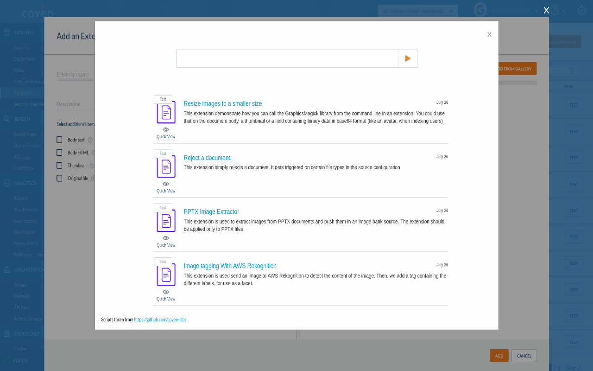
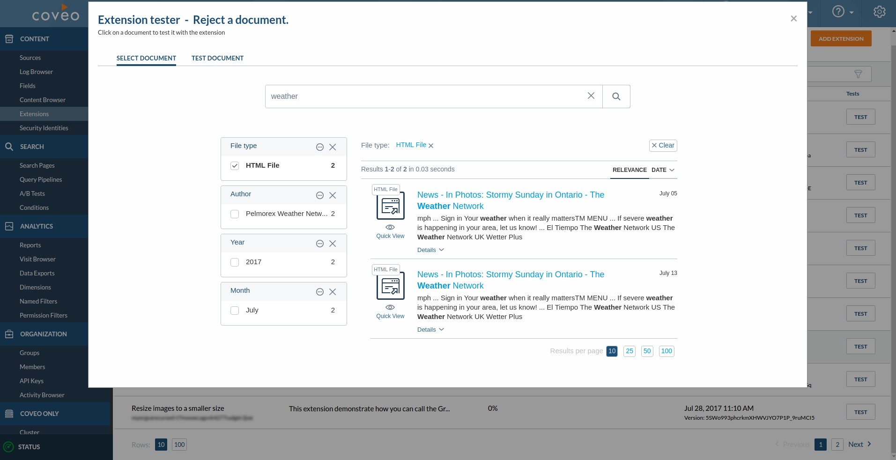

# Coveo extension manager
Manages and helps test pipeline extensions. With this extension, you can quickly add an extension from an existing gallery that gets updated then test it right after with any document avaible in the organization. This improves how quickly one can test extensions and find mistakes.

## Install

If you are on Coveo domain, you can install from the [Chrome Web Store](https://chrome.google.com/webstore/detail/tester-for-indexing-pipel/gbaapjhekfgfnjkijijdfkllbfhobieb?hl=en-US).

## Description
This extension has 2 parts to it:
1. The extensions gallery
2. The extension tester

### The gallery
The extension gallery can be found when one clicks on the "Add Extension" button in the top right of the extensions page.
This is what is looks like:

When clicked on, a Coveo seach pops up with a list of available extensions. The extensions are added by the python script portion of the repo.

#### Additional notes
You can setup your own extension gallery, simply follow the instructions in the python section of this repo, then
change where where the content is being taken. Head to chrome://extensions/ and click on the options dialog.

### The tester
'Test' buttons can be found beside every extension

Clicking on a 'Test' button will bring up the test interface

Simply clicking on the document you want to test will start the test and the results will appear

## How to build
1. Download/clone git repo
2. Turn on developer mode in chrome
3. Load unpacked extension
4. Find the `chrome_extension` folder in the repo under the `misc` folder

## Build extension package

Bash command to build the package for the Chrome Web Store:
> `zip -r9 pipeline_extension_manager_v$(node -p -e "require('./manifest.json').version").zip manifest.json content-script.js css html icons js`

## How to run
Head to the Coveo Cloud Platform extension's tab

## Dependencies
Google Chrome or Chromium

## Demo
Demo of adding a new extesion then testing it immediately with an existing document

## Notes
The tester is only capable of getting indexed metadata, Body Text, Body HTML and Thumbnail.
Some metadata only exists when a real extension is being ran, so results may vary.
So in some cases, it's better to test with re-building a source.

It is currently not possible to test with a datastream in prod. The next rollout (August 5th, 2017) will allow this feature to work.

This was tested on Chromium 58.0 running Ubuntu 16.04

No additional support will be provided by the Coveo-Labs team
